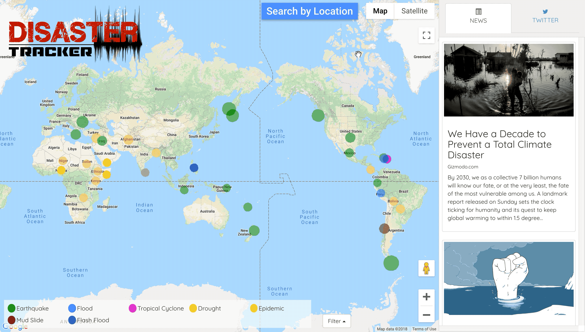

# Disaster Tracker
> Website that presents information on recent disasters and displays related news or Twitter details.

Disaster Tracker is a website that pulls disaster information from ReliefWeb and EarthquakeUSGS APIs. The right hand display uses the Google News and Twitter APIs, and clicking on the map markers filters the information to show related data.

Under the "Search By Location" toggle, the user is able to enter in a location and email to recieve information about nearby disasters.

This project was originally created in a 48 hour coding hackathon with 3 other team members:
David Ahn [https://github.com/d-ahn10](https://github.com/d-ahn10)
Hank Kim [https://github.com/citation0097](https://github.com/citation0097)
Kyle Pamintan [https://github.com/kylepamintuan](https://github.com/kylepamintuan)

## Installation

> 1. Clone repo
>    - `git clone https://github.com/rpan06/disaster-tracker.git`
> 1. Change directory into the newly cloned repo
>    - `cd disaster-tracker`
> 1. Install dependencies
>    - `npm install`
> 1. Configure with your email and MongoDB info
>    - `cp config.default.js config.js`
> 1. Start dev server
>    - `npm start`
> 1. Open a browser and navigate to `localhost:3000`

## Meta

Rachel Pan - rpan06@gmail.com

[https://github.com/rpan06/](https://github.com/rpan06/)
